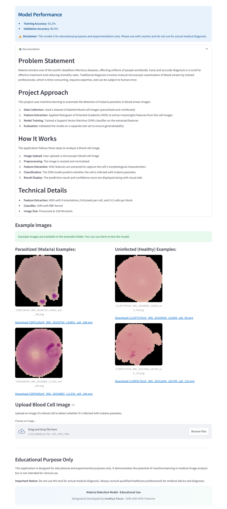
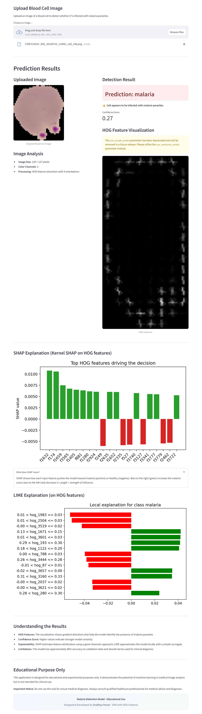

# 🦠 Malaria Cell Detection using HOG + SVM

[](https://www.python.org/downloads/)
[](https://scikit-learn.org/)
[](https://streamlit.io)
[](https://opensource.org/licenses/MIT)

Classical computer vision pipeline to classify malaria-infected vs. uninfected red blood cell images using HOG (Histogram of Oriented Gradients) features and an SVM classifier. Lightweight, fast, and deployable without GPUs.

## 🎯 Overview

- **Task**: Binary image classification (Parasitized vs. Uninfected)
- **Approach**: Hand-crafted features (HOG) + Linear/RBF SVM
- **Why**: Interpretable, small footprint, quick to train/infer

## 📚 Dataset

- Common source: NIH Malaria Cell Images dataset (Parasitized / Uninfected)
- Direct download (zip): https://huggingface.co/spaces/aradhyapavan/malaria-cell-detection-using-hog/blob/main/cell_images.zip
- Example images are provided under `examples/`
- Typical structure if you place full dataset:
```text
data/
  train/
    Parasitized/
    Uninfected/
  val/                # optional
    Parasitized/
    Uninfected/
  test/
    Parasitized/
    Uninfected/
```

## 🧠 Method

- Preprocess: resize, grayscale, normalization
- Features: HOG (configurable orientations, cell/block sizes)
- Model: SVM (Linear/RBF, tune C and gamma)
- Metrics: Accuracy, Precision, Recall, F1, Confusion Matrix

## 🛠️ Installation

## 🚧 Getting Started

```bash
git clone https://github.com/aradhyapavan/Machine-Learning-Projects.git

cd Machine-Learning-Projects/malaria-cell-detection-using-hog
```

```bash
python -m venv .venv
# Windows
.\.venv\Scripts\activate
# macOS/Linux
# source .venv/bin/activate

pip install -r requirements.txt  # if present
# Or minimal deps
pip install numpy scipy scikit-image scikit-learn matplotlib opencv-python joblib streamlit
```


## 📁 Project Structure

```text
malaria-cell-detection-using-hog/
├─ app.py                            # Streamlit app (prediction UI)
├─ extract.py                        # Utility (e.g., unzip dataset)
├─ Malaria_Detection_SVM_HOG.ipynb   # Notebook (EDA/training)
├─ malaria_svm_hog_model.joblib      # Trained SVM model
├─ label_encoder.joblib              # Label encoder for classes
├─ train.csv                         # Sample metadata/splits
├─ examples/                         # Sample images
├─ requirements.txt                  # Python dependencies
├─ Dockerfile                        # Container config
└─ README.md                         # Space/Config readme (Hugging Face style)
```

## 🚀 Quickstart

### 1) Run the Streamlit app
```bash
streamlit run app.py
```
- Upload/select an image to get prediction and confidence score.

### 2) Train the model (via notebook)
Use the Jupyter notebook to train and export artifacts:
- Open `Malaria_Detection_SVM_HOG.ipynb`
- Run all cells to extract HOG features, train the SVM, and export:
  - `malaria_svm_hog_model.joblib`
  - `label_encoder.joblib`
- Place the exported files in this project root (same folder as `app.py`).

## ⚙️ HOG Parameters (starting points)
- Image size: 128x128
- Orientations: 9
- Pixels per cell: 8x8
- Cells per block: 2x2
- Block norm: L2-Hys

## 📸 Snapshots

### Malaria App UI


### Results with AI Explainability


## 📊 Tips
- Use class weights in SVM if class imbalance exists
- Keep consistent cropping/alignment of cells
- Try concatenating color channels (HOG per channel)
- CLAHE (Contrast Limited Adaptive Histogram Equalization): enhances local contrast; try clipLimit 2.0 and tileGridSize (8,8)

## 🔍 AI Explainability
- SHAP (Kernel SHAP on HOG features): shows which HOG features pushed the prediction toward Parasitized or Uninfected
- LIME (Local surrogate on HOG features): approximates the model near the uploaded image and highlights the most influential features

## 👤 Author
- Aradhya Pavan
- Monorepo: https://github.com/aradhyapavan/Machine-Learning-Projects
