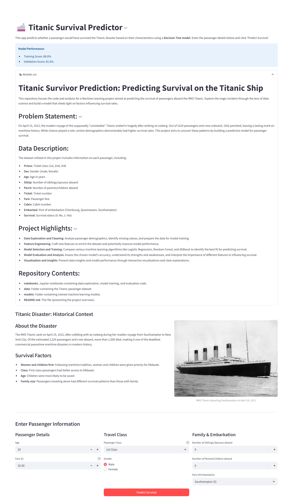
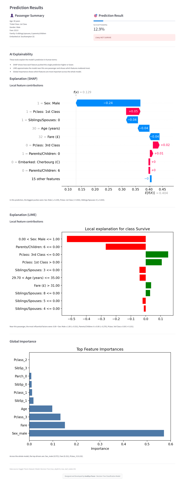

# 🚢 Titanic Survivor Prediction

[](https://huggingface.co/spaces/aradhyapavan/titanic-survival-predictor)
[](https://www.python.org/downloads/)
[](https://opensource.org/licenses/MIT)
[](https://huggingface.co/spaces/aradhyapavan/titanic-survival-predictor)

Predicting Survival on the Titanic Ship using Machine Learning and a Streamlit app.

This repository houses the code and analysis for a project aimed at predicting the survival of passengers aboard the RMS Titanic. Explore the tragic incident through the lens of data science and build a model that sheds light on factors influencing survival rates.


## 🌐 Live Demo

**Try the live application**: [🚢 Titanic Survival Predictor](https://huggingface.co/spaces/aradhyapavan/Titanic_Survival_Predictor)

## 📊 Model Performance

- **🎯 Training Accuracy**: 88.0%
- **✅ Validation Accuracy**: 81.6%
- **🌳 Model Type**: Decision Tree (max_depth=8, max_leaf_nodes=25)
- **🔧 Features**: 24 engineered features from passenger data

## Problem Statement

On April 15, 1912, the maiden voyage of the supposedly "unsinkable" Titanic ended in tragedy after striking an iceberg. Out of 2,224 passengers and crew onboard, 1,502 perished, leaving a lasting mark on maritime history. While chance played a role, certain demographics demonstrably had higher survival rates. This project aims to uncover these patterns by building a predictive model for passenger survival.

## Dataset

This project uses the famous Titanic passenger dataset (e.g., the Kaggle "Titanic: Machine Learning from Disaster" competition).

Features include (typical columns):
- **Pclass**: Ticket class (1st, 2nd, 3rd)
- **Sex**: Gender (male, female)
- **Age**: Age in years
- **SibSp**: Number of siblings/spouses aboard
- **Parch**: Number of parents/children aboard
- **Ticket**: Ticket number
- **Fare**: Passenger fare
- **Cabin**: Cabin number
- **Embarked**: Port of embarkation (Cherbourg, Queenstown, Southampton)
- **Survived**: Survival status (0: No, 1: Yes)

You can obtain the dataset from Kaggle and place the CSV files in the `data/` directory:

- Training data: `data/train.csv`
- Test/holdout (optional): `data/test.csv`

Reference: `https://www.kaggle.com/c/titanic`

## Project Highlights

- **Data Exploration and Cleaning**: Analyze passenger demographics, identify missing values, and prepare the data for model training.
- **Feature Engineering**: Craft new features to enrich the dataset and potentially improve model performance.
- **Model Selection and Training**: Compare algorithms like Logistic Regression, Random Forest, and XGBoost to identify the best fit for predicting survival.
- **Model Evaluation and Analysis**: Assess accuracy, understand strengths/weaknesses, and interpret feature importance.
- **Visualization and Insights**: Present data insights and model performance through clear visualizations.
- **🧠 AI Explainability**: SHAP and LIME explanations for model transparency

## Streamlit App

An interactive Streamlit app allows you to:
- Enter passenger features (e.g., age, sex, class, siblings/spouse, parents/children, fare, embarkation).
- Run the trained model to get a survival prediction and probability.
- Explore AI explanations (SHAP/LIME) for individual predictions.
- View historical context about the Titanic disaster.

Run locally:

```bash
streamlit run app.py
```

Then open the provided local URL in your browser.

## Repository Structure

```text
Titanic_Survival_Predictor/
├─ app.py                          # Streamlit application
├─ data_cleaned.csv                # Preprocessed dataset
├─ titanic_decision_tree_model.joblib  # Trained model
├─ feature_names.joblib            # Feature names list
├─ requirements.txt                # Python dependencies
├─ README.md                       # HuggingFace documentation
├─ github_readme.md               # Project documentation (this file)
└─ Dockerfile                      # Docker containerization
```

Note: The project structure has been updated to reflect the actual files in this repository.

## Getting Started

### 1) Clone the Repository

```bash
git clone https://github.com/aradhyapavan/Machine-Learning-Projects.git

cd Machine-Learning-Projects/titanic-survival-predictor
```

### 2) Create and Activate a Virtual Environment

Windows (PowerShell):
```bash
python -m venv .venv
.\.venv\Scripts\activate
```macOS/Linux:
```bash
python3 -m venv .venv
source .venv/bin/activate
```

### 3) Install Dependencies

```bash
pip install --upgrade pip
pip install -r requirements.txt
```

### 4) Launch the Streamlit App

```bash
streamlit run app.py
```

The dataset is already preprocessed and included as `data_cleaned.csv`, and the trained model files are included, so you can run the app immediately.

## 🐳 Docker Deployment

```bash
# Build the image
docker build -t titanic-predictor .

# Run the container
docker run -p 7860:7860 titanic-predictor
```

## Model Details

The trained Decision Tree model artifacts (`.joblib` files) are included in the repository:
- `titanic_decision_tree_model.joblib`: The trained model
- `feature_names.joblib`: Feature names for the model

The Streamlit app loads these models automatically for predictions.

## 🔍 AI Explainability Features

### SHAP (SHapley Additive exPlanations)
- Shows how each feature contributes to individual predictions
- Waterfall plots for feature contributions
- Global feature importance analysis

### LIME (Local Interpretable Model-agnostic Explanations)
- Explains individual predictions in human terms
- Local approximation of model behavior
- Feature contribution visualization

## 🌐 Deployment Options

### 🤗 Hugging Face Spaces
This project is deployed on Hugging Face Spaces using Docker for seamless access and scalability.

**Live App**: [https://huggingface.co/spaces/aradhyapavan/titanic-survival-predictor](https://huggingface.co/spaces/aradhyapavan/titanic-survival-predictor)

### ☁️ Streamlit Cloud
Can also be deployed directly from GitHub repository to Streamlit Cloud.

## 📸 Snapshots

### Main Application Interface


### Prediction Results with AI Explanations


*Screenshots show the interactive Streamlit application with passenger input forms, prediction results, and AI explainability features.*

## Acknowledgments

- Dataset: Titanic – Machine Learning from Disaster (Kaggle)
- Streamlit for rapid app development
- 🤗 Hugging Face Spaces for hosting


---

*Designed and Developed by **Aradhya Pavan***


